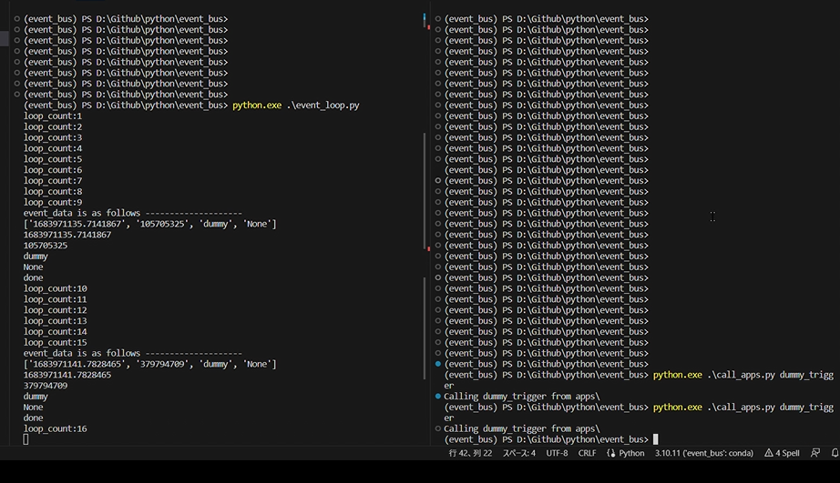

# event_bus
 Creating the core of event-driven systems by using Python.

# set up
Environment setup: run <br>
```pip install -r requirement.py```

## sample #1
Very simple callback system.
1. Open two terminals and move to "event_bus" directory. <br>
2. On one of the terminals (name this one as #1), run <br>
```python event_loop.py``` <br>
3. On the other terminals (name this one as #2), run <br>
```python call_apps.py dummy_trigger```<br>
You may run this code as many as you want. <br>
Every time you run it, there will be a data shown in terminal #1.<br>

### How sample #1 looks like.


# thought
Qiita (Japanese): https://qiita.com/shiganai/items/76996ffdc4439103d6a4
